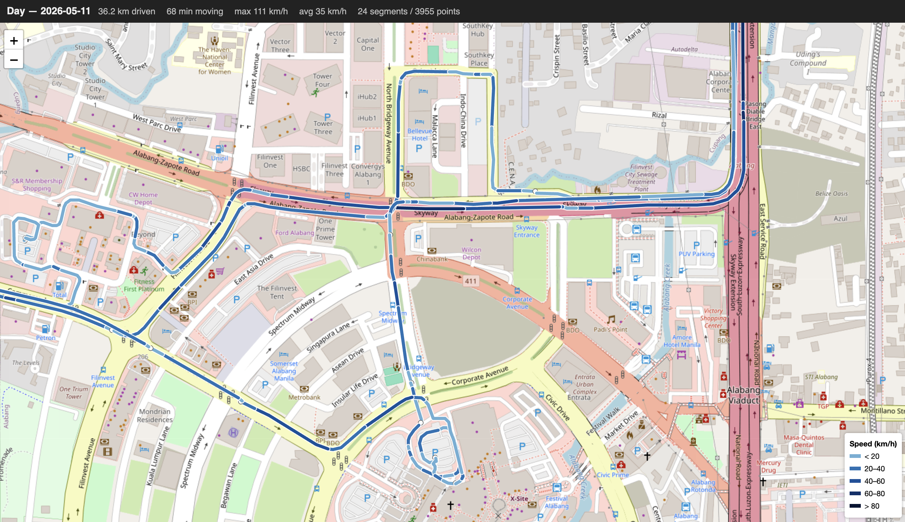

# dashcam-exporter (for "DDPAI Mola N3 Pro" model)

Turn the raw front + rear clips from a DDPAI dashcam SD card into one polished
MP4 per drive — or per day — with a moving GPS map widget, speed overlay,
date/time burn-in, automatic parking-skip, and per-day HTML / GPX / Google
Maps sidecars.

> **DDPAI only.** The card layout, GPS log format, and clip naming convention
> are specific to DDPAI cameras. Tested with **DDPAI Mola N3 Pro**. Should work
> with any DDPAI variant that uses the layout shown below.
>
> **Developed and tested on macOS.** It should work on Linux. **It has not
> been tested on Windows** — the basics (Python, ffmpeg, paths) are all
> cross-platform via `pathlib`, but font detection and default file paths are
> tuned for macOS. If you try it on Windows please open an issue.

Expected SD-card layout:

    /Volumes/NO NAME/DCIM/
        200video/front/   YYYYMMDDhhmmss_NNNN.mp4
        200video/rear/    YYYYMMDDhhmmss_NNNN_A.mp4
        203gps/           YYYYMMDDhhmmss_NNNN_D.gpx        # loose NMEA logs
        203gps/tar/       YYYYMMDDhhmmss_NNNN.git          # tarred NMEA logs


## Example output

Default layout — front camera, rear PiP bottom-centre, timestamp + speed +
watermark in corners, stats panel + map widget on the right:


Same composition with the rear PiP repositioned to the top-left corner
(`rear_pip_position = top-left` in config.txt):


The interactive HTML map sidecar (Leaflet + OSM tiles, route coloured by
speed, segment-break dots, opens in any browser):




## What you get

For each "drive" (a run of consecutive clips, default ≤90 s gap) — or each
calendar day in `--daily` mode — the script produces:

| File | What it is |
|------|------------|
| `drive_NN_YYYY-MM-DD_HH-MM.mp4` | Final video. 2402×1080 with map widget, or 1920×1080 without. |
| `drive_NN_….html`                | Self-contained Leaflet/OSM interactive map. |
| `drive_NN_….gpx`                 | Standards-compliant GPX. Opens in Google Earth, Strava, Maps.me, Komoot. |
| `drive_NN_…_links.txt`           | Google Maps + Apple Maps URLs and trip stats. |

The video frame layout (defaults):

```
+----------------------------------------+----------+
|                                        | Day      |
|                                        | 2026-…   |
|              FRONT CAMERA              | Distance |
|                                        | Driven   |
|                                        | Max …    |
|                                        | Avg …    |
|                                        |          |
|         +------------------+           | +------+ |
|         |   REAR CAMERA    |           | | MAP  | |
|         +------------------+           | |      | |
|                                        | +------+ |
|                                        |          |
| 2026-05-11 18:07:52         19 km/h    |          |
|                      (c) Watermark …   |          |
+----------------------------------------+----------+
       1920 px main video                  480 px panel
                       2402 × 1080
```

Composed in this order:

1. **Front camera** — cropped (configurable bonnet trim) and scaled to 1920×1080.
2. **Rear PiP** — 662×372 with a thin white border. Position configurable
   (bottom-middle by default; or top-left / top-middle / top-right — the
   bottom-left/right corners are reserved for the timestamp and speed +
   watermark overlays). Auto-disabled if your dashcam has no rear camera.
3. **Timestamp** — `YYYY-MM-DD HH:MM:SS` burned into the bottom-left,
   advancing per frame from the clip's filename timestamp.
4. **Speed** — NN km/h (or NN mph) rendered as 1-second SRT subtitles in
   the bottom-right corner. Only when GPS data exists for the clip.
5. **Watermark** — small `©` line just below the speed (or any other corner
   via config; text is configurable).
6. **Stats panel** — Day title, distance, moving time, max + avg speed,
   segments / GPS points, plus the route map with a moving marker. The full
   route is shown coloured by speed; the marker steps once per second.
   Stats text can be omitted while keeping the map.

When a drive has no GPS at all, the script falls back to plain 1920×1080
output (no map widget, no speed overlay) so per-drive output sizes stay
consistent within a run.


## Parking-skip

`--daily` runs often contain long stretches of "engine on, parked" footage at
your destination. By default the script:

1. Detects parked runs of 5+ minutes (configurable).
2. Keeps the **first 10 seconds** of the first parked clip (you & passengers
   getting out).
3. Inserts a 2-second `Fast forwarding… 46m 15s skipped` slide that also
   reports the wall-clock time elided.
4. Anchors the **exit slice** to the actual drive-resume moment in the next
   moving clip — so you land exactly when the wheels start turning, not in
   the middle of more parked footage.

Disable with `--no-skip-parking`, or tune `parking_min_secs` /
`parking_pad_secs` in `config.txt`.


## Install (macOS)

The script needs **ffmpeg** with the `drawtext` (libfreetype) and `subtitles`
(libass) filters. The plain Homebrew `ffmpeg` doesn't include those — use
`ffmpeg-full`:

```sh
brew install ffmpeg-full
brew unlink ffmpeg 2>/dev/null
brew link --overwrite ffmpeg-full
```

Then the Python dependencies (only needed for the burn-in map widget):

```sh
python3 -m venv .venv
source .venv/bin/activate
pip install -r requirements.txt
```

The venv matters because Homebrew Python 3.12+ blocks system-wide `pip
install` per PEP 668. Re-activate the venv (`source .venv/bin/activate`) at
the start of every new terminal session.

Dependencies: `staticmap` (OSM tile background) and `Pillow` (marker
compositing). If you don't install them, the script still runs but skips the
burn-in map widget. Pass `--no-map-widget` to silence the warning.


## Install (Linux / WSL)

Same idea, different package manager:

```sh
sudo apt install ffmpeg                    # Debian/Ubuntu — usually includes drawtext + subtitles
python3 -m venv .venv && source .venv/bin/activate
pip install -r requirements.txt
```


## Install (Windows — untested)

Treat the steps below as best-effort guesses based on cross-platform
behaviour. **The script has not been tested on Windows.**

```powershell
# ffmpeg — pick one
winget install Gyan.FFmpeg          # or:  choco install ffmpeg-full
                                    # or:  scoop install ffmpeg

# Python deps
python -m venv .venv
.\.venv\Scripts\Activate.ps1
pip install -r requirements.txt
```

Things to watch out for:

- Default `root = /Volumes/NO NAME` will not exist — set `root = E:\` (or
  whatever drive letter your SD card mounts as) in `config.txt`.
- Default `out = ~/Desktop/Dashcam_Videos` works via `pathlib` (resolves to
  `C:\Users\<you>\Desktop\…`).
- VideoToolbox doesn't exist on Windows; encoding will fall back to
  software libx264 automatically (slower, but works).
- The script tries macOS fonts first then a few common Windows fonts
  (`courbd.ttf`, `cour.ttf`, `arial.ttf`). If none are found, pass
  `--no-timestamp` and `--no-watermark`-equivalent (`watermark_text =`).


## Quick start

```sh
source .venv/bin/activate           # macOS / Linux

# Dry-run to see what would be encoded (lists each group with its index)
python3 make_dashcam_videos.py --dry-run

# Encode every drive on the card with full overlays
python3 make_dashcam_videos.py

# Same but merge by calendar date (one MP4 per day)
python3 make_dashcam_videos.py --daily

# Only specific groups — see "Groups & indices" below
python3 make_dashcam_videos.py --drives 13 14

# Read from a local backup instead of the SD card, write somewhere specific
python3 make_dashcam_videos.py --root ~/dashcam_backup/2026-05-11 --out ~/Movies/Dashcam

# Just refresh the .html / .gpx / _links.txt sidecars without re-encoding video
python3 make_dashcam_videos.py --daily --sidecars-only

# Smaller output file for web/mobile sharing
python3 make_dashcam_videos.py --output-height 720
```


## Helper shell scripts

For the common workflows there are four ready-to-run shell scripts in the
repo root. **Open them once and uncomment the `OPTS+=(…)` lines for any
settings you regularly want** that you DON'T already have in `config.txt`
(e.g. `--root /path/to/local/sd-card-copy`, `--out ~/Movies/Dashcam`,
`--output-height 720` for web-sized output). Anything you put in
`config.txt` is loaded automatically and doesn't need to go in the scripts.

| Script | What it does |
|--------|--------------|
| `./list-single-drives-data.sh`           | Dry-run in drive mode. Lists every engine-on session with its 1-based index. |
| `./list-daily-drives-data.sh`            | Dry-run in daily mode. Lists each calendar day as one group with its 1-based index. |
| `./make-single-drives.sh [N N …]`         | Encode in drive mode. Pass the indices you want; with no args, encodes every drive. |
| `./make-daily-drives.sh  [N N …]`         | Encode in daily mode. Pass the indices you want; with no args, encodes every day. |

Typical end-to-end:

```sh
source .venv/bin/activate
./list-daily-drives-data.sh           # see what's on the card
./make-daily-drives.sh 8              # encode just day 8
```


## Groups & indices

The script always processes "groups" of clips. What a group is depends on the
mode:

- **drive mode** (default): each group is a contiguous engine-on session —
  i.e. a run of clips where consecutive timestamps are within `--gap`
  seconds of each other (default 90 s).
- **`--daily` mode**: each group is one calendar date; every clip on that
  date belongs to one group regardless of engine-off intervals.

Groups are numbered 1, 2, 3, … in the order they appear in `--dry-run`. The
`--drives N [N …]` flag (the name is historical; it works in both modes)
selects specific groups by index. Examples:

```sh
# See the indices first
python3 make_dashcam_videos.py --daily --dry-run
# →  Day  1  2026-04-02 12:30  ->  12:31     1 clips
#    Day  2  2026-04-11 21:16  ->  21:24     3 clips
#    …
#    Day  8  2026-05-11 12:11  ->  19:07   104 clips

# Then encode only Day 8
python3 make_dashcam_videos.py --daily --drives 8
```

Indices are stable within a single run but can shift if you change `--gap`
or `--daily`, since the grouping changes. Always do `--dry-run` first when
in doubt.


## Output sizes

The composite video frame is **2402×1080** by default (1920 main video + 2 px
gutter + 480 panel). Use `--output-height` (or `output_height` in
`config.txt`) to downscale the whole composite at the end of the pipeline.
Aspect ratio is preserved automatically.

| Setting | Composite size | Typical file size, 1 h source | Best for |
|---------|----------------|--------------------------------|----------|
| `output_height = 0` (default) | 2402 × 1080 | ~3.5 – 4 GB | Archive, big-screen viewing |
| `output_height = 720`         | 1601 × 720  | ~1.5 – 2 GB | Web / streaming, decent on phones |
| `output_height = 540`         | 1201 × 540  | ~700 – 900 MB | Mobile sharing, email-ish |

These are end-pipeline scales — the encoder still works on the native
2402×1080 frame, so the overlays stay crisp. File sizes assume the default
`vt_bitrate = 8M` / `x264_crf = 23`; tune those if you need smaller. Quality
above 720p is generally lost to internet compression once you upload, so
`--output-height 720` is the sweet spot for sharing.

When `map_widget = false` the panel is dropped and the composite is just
1920×1080 (or `output_height` × 16:9), shaving roughly 20 % off file size.


## config.txt — the main way to tweak things

Run once to dump a fully-commented template into the repo:

```sh
python3 make_dashcam_videos.py --write-config ./config.txt
```

Then uncomment whatever lines you want to change. Precedence is **CLI flag >
config.txt > built-in default**. Highlights:

- `root`, `out` — input / output paths
- `daily` / `gap` — grouping
- `audio = false` — strip audio entirely (passenger conversation privacy)
- `speed_unit = kmh | mph` — unit shown on overlay + stats + HTML + links.txt
  (GPX export is always m/s per the spec)
- `front_crop_top` / `front_crop_bottom` — tune for different bonnet shapes
- `rear_pip = true | false`, `rear_pip_position`, `rear_pip_w/h/margin`
- `map_widget`, `map_panel_w`, `map_panel_position = right | left`,
  `map_panel_gutter_px`, `panel_stats = true | false`
- `skip_parking`, `parking_min_secs`, `parking_pad_secs`
- `watermark_text`, `watermark_position`, `watermark_font_size`,
  `watermark_margin_h/v`
- `speed_font_size`, `speed_margin_v`, `speed_margin_r`
- `output_height` — 0 for native, 720 for web, 540 for mobile-friendly
- `vt_bitrate`, `vt_maxrate`, `x264_preset`, `x264_crf`


## CLI flags

| Flag | Effect |
|------|--------|
| `--config PATH`         | Use a config.txt at a non-default location. |
| `--write-config PATH`   | Dump the fully-commented config template and exit. |
| `--root PATH`           | Dashcam SD-card / backup root (default: `/Volumes/NO NAME`). |
| `--out PATH`            | Output folder (default: `~/Desktop/Dashcam_Videos`). |
| `--daily`               | Group clips by calendar date instead of by gap. |
| `--gap N`               | Seconds-between-clips threshold for drive grouping (default 90). |
| `--drives N [N …]`      | Only process specific group numbers (1-based). |
| `--software`            | Force libx264 instead of VideoToolbox. |
| `--no-timestamp`        | Skip the date/time overlay. |
| `--no-speed`            | Skip the GPS speed overlay even when GPX data exists. |
| `--no-audio`            | Strip audio from the output. |
| `--no-map-sidecars`     | Skip the `.html` / `.gpx` / `_links.txt` sidecars. |
| `--no-map-widget`       | Skip the burn-in map panel (output stays 1920×1080). |
| `--sidecars-only`       | Only (re-)generate sidecars; don't re-encode video. |
| `--no-skip-parking`     | Disable parking-skip. |
| `--parking-min-secs N`  | Minimum parked-run length (s) before we skip (default 300). |
| `--parking-pad-secs N`  | Seconds kept at each end of a skipped run (default 10). |
| `--output-height N`     | Downscale final composite to this height in px (0 = native). |
| `--keep-intermediates`  | Don't delete per-clip intermediates after concat. |
| `--dry-run`             | List drives / days and exit without encoding. |


## How grouping works

Each front-clip filename is paired with its matching rear clip and the clips
are ordered by timestamp.

In **drive mode** (default), a new drive starts whenever the gap between the
end of one clip and the start of the next exceeds `--gap` seconds. This
usually corresponds to engine-off events.

In **`--daily` mode**, all clips on the same calendar date go into one
group, regardless of engine-off intervals.


## How GPS speed is sourced

The dashcam writes GPS logs to `DCIM/203gps/` in NMEA format
(mislabeled with a `.gpx` extension). Older sessions are rolled up into
POSIX tar archives in `203gps/tar/` (mislabeled with a `.git` extension —
they are **not** Git data, just tar archives).

On startup the script:

1. Lists every loose `.gpx` in `203gps/`.
2. Extracts every `.gpx` member from every `.git` tar in `203gps/tar/` into
   `OUT_DIR/.gpx_cache/` (cached across runs).
3. For each clip, looks for a matching `.gpx` in either location.

The speed overlay is rendered per second from the `$GPRMC` speed-in-knots
field. For the demo card this expanded GPS coverage from **25 → 90 clips
(out of 117)**.

The GPS track is segmented before drawing so engine-off intervals don't get
bridged by phantom straight lines across town, and the polyline is coloured
by speed using a blue→navy palette that pops against OSM's yellow/orange
roads.


## Output layout

After a typical `--daily` run:

```
~/Desktop/Dashcam_Videos/
├── day_2026-04-02.mp4
├── day_2026-04-11.mp4
├── …
├── day_2026-05-11.mp4
├── day_2026-05-11.html
├── day_2026-05-11.gpx
├── day_2026-05-11_links.txt
├── .gpx_cache/              # harvested tar contents, reused across runs
└── .intermediates/          # per-clip work, cleaned up unless --keep-intermediates
```


## Performance

Hardware-accelerated encoding via `h264_videotoolbox` on an Apple-silicon Mac
gets you roughly 5–10× realtime, so ~2 hours of source footage encodes in
15–25 minutes. On Linux/Windows you fall back to software libx264 — still
fine, just slower.

The script is **restartable**:

- If a final `.mp4` already exists in `--out`, that drive/day is skipped.
- Per-clip intermediates in `.intermediates/` are reused if present.
- Harvested GPX in `.gpx_cache/` is reused across runs.
- Sidecars are emitted unconditionally (even when the .mp4 already exists),
  so segmentation / palette / unit tweaks land via a quick `--sidecars-only`
  run.

To force a re-encode of one drive: delete its final `.mp4` (and the matching
intermediates if you want fresh per-clip work too).


## Troubleshooting

**`No such filter: 'drawtext'`** — ffmpeg without libfreetype. Install
`ffmpeg-full` (see Install), or run with `--no-timestamp`.

**`Unable to open … speed.srt` / `subtitles` errors** — ffmpeg without
libass. Install `ffmpeg-full`, or run with `--no-speed`.

**`no rear pair for YYYYMMDDhhmmss, skipping`** — A front clip exists with no
matching rear. The script drops it. To use a front-only setup set
`rear_pip = false` in `config.txt`.

**`map: (no GPS data for this day)`** — Clip filenames in that group don't
match any GPX (loose or tarred). Normal for drives without GPS lock.

**`Output looks squashed horizontally`** — Player isn't honouring SAR. The
video is yuv420p with square pixels; QuickTime / VLC / IINA all handle it.

**`OSM tile fetch failed (…)`** — Network problem during burn-in widget
render. The HTML map (Leaflet) still works fine since OSM tiles load in your
browser at view time.

**`error: externally-managed-environment`** — Homebrew Python blocks
system-wide `pip install` (PEP 668). Use the venv recipe in Install.

**`! map widget skipped: PIL/Pillow not installed`** — venv not activated,
or `pip install -r requirements.txt` was never run. Video still encodes at
1920×1080 with all other overlays.


## Architecture

Pipeline per clip:

```
front.mp4 ─┐
           ├─► ffmpeg filter_complex:
rear.mp4  ─┤    crop + scale front  →  [front]
           │    scale + border rear  →  [rear]
           │    overlay [rear] on [front] at chosen position
           │    drawtext timestamp (bottom-left)
           │    subtitles speed.srt (bottom-right)
           │    drawtext watermark (chosen corner)        → [video_part]
map.mp4   ─┤    [2:v] scale to 480×1080 + 2-px gutter pad → [map_part]
           │    hstack [video_part][map_part]              → [out]
           ▼
       clip_NN.mp4  (intermediate, 2402×1080)
           ▼
       concat-demuxer  (stream-copy, no re-encode)
           ▼
       final drive_NN.mp4
```

The map.mp4 is produced by PIL/staticmap:

```
all GPX points for the drive  →  base panel PNG (stats + route + start/end markers)
                                 +
each second of clip            →  marker dot composited on base PNG
                                 ↓
                             PNG sequence
                                 ↓
                         ffmpeg 1-fps mp4  →  map.mp4
```

The 1-fps map gets upsampled to 30 fps by the main filter chain, so the
marker visibly steps once per second.


## Repo layout

```
dashcam-exporter/
├── make_dashcam_videos.py        # the single-file script (entry point)
├── config.txt                    # generated by --write-config; edit to taste
├── requirements.txt              # Pillow + staticmap
├── list-single-drives-data.sh    # dry-run, drive mode
├── list-daily-drives-data.sh     # dry-run, daily mode
├── make-single-drives.sh         # encode a chosen drive (or all)
├── make-daily-drives.sh          # encode a chosen day  (or all)
├── examples/                     # screenshots used in this README
├── .gitignore
├── LICENSE
└── README.md                     # this file
```


## Funding

- 🏅 https://github.com/sponsors/raoulsson
- 🪙 https://www.buymeacoffee.com/raoulsson


## License

MIT — see [LICENSE](LICENSE).

Copyright © 2026 Raoul Marc Schmidiger ([hello@raoulsson.com](mailto:hello@raoulsson.com)).

---

**Happy Driving! 🎉**
