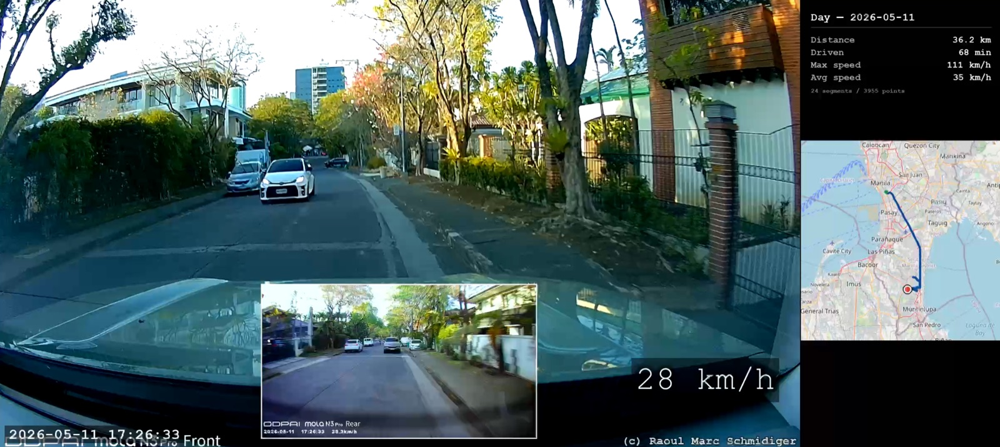
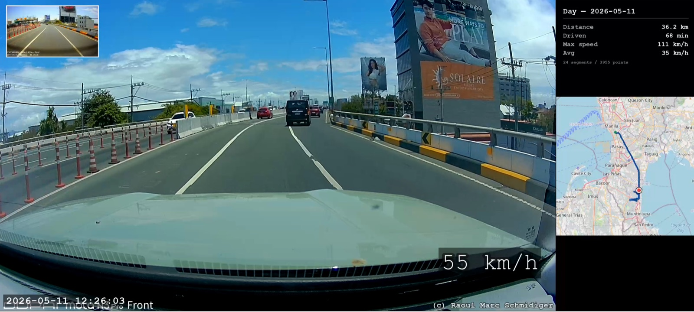
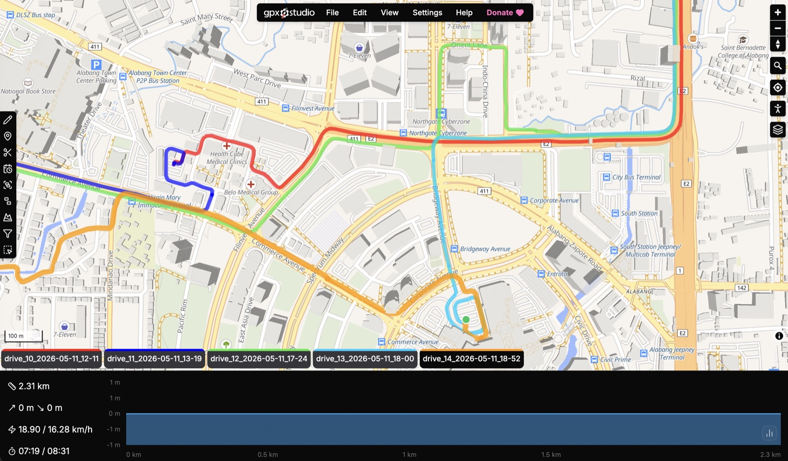

# dashcam-exporter

Turn a dashcam SD card into watchable drives.

A DDPAI camera writes one-minute clips, thousands of them, with the GPS track in
a separate file and no idea where one journey ends and the next begins. This
reads the card, works out where you actually drove, and renders each journey as
a single video — moving map, speed readout, timestamp burned in, parking cut.
Then, if you want, it publishes them to a private website only the people you
invite can see.

It is one interactive tool. You pick a numbered step, and it tells you what it
is about to do and what that will cost before it does it.

> **DDPAI only.** The card layout, GPS log format and clip naming are specific to
> DDPAI cameras. Developed against a **Mola N3 Pro**, on macOS. Linux should
> work. Windows is untested.

---

## Start here

```bash
git clone git@github.com:raoulsson/dashcam-exporter.git
cd dashcam-exporter
./INSTALLER.sh              # builds .venv, installs everything, checks ffmpeg
./RUN-DASHCAM-EXPORTER.sh   # the tool
```

`INSTALLER.sh` needs ffmpeg on the system (`brew install ffmpeg`, `apt install
ffmpeg`) — the one thing it cannot install for you. Everything else it handles,
and it is safe to run again.

`RUN-DASHCAM-EXPORTER.sh` takes no arguments. Neither does the tool behind it:
every setting lives in `config.txt`, and the private ones in `.env`. That is
deliberate — see [One source of truth](#one-source-of-truth).

---

## What it looks like

```
  dashcam pipeline   card -> render -> folder(~/dashcam-published)
  uploader edition — README.md has the step graph and what each edition does.

-- status ---------------------------------------------------------------------
  Source       present  /Volumes/NO NAME  (222 clips)
  Import       ~/dashcam-data/import/2026-07-28  612 clips, 116.6 GB
  Rendered     6 mp4  8.3 GB in ~/dashcam-data/output
  Local site   ~/dashcam-data/output/dashcam_export_data_site.html  built 22 min ago
  Folder       ~/dashcam-published  29 file(s)
  Repo         ~/dev/dashcam-exporter
--------------------------------------------------------------------------------
  disk: 238.8 GB free of 917.0 GB
--------------------------------------------------------------------------------
  0) Progress             3) Build Preview        6) Build Website        9) Delete SIM Data
  1) Import SIM           4) Exclude Trip         7) Upload Website
  2) Generate Meta        5) Render Videos        8) Clean Workspace
   9) no card at ~/dashcam-data/card
   1,7) not from here — the graph does not offer them yet
   at: 5) Render Videos   s = status   q = quit    (4,8,9 destroy footage)

Select>
```

The menu is drawn from the state machine, so everything on it is an answer
rather than a label. An item you cannot pick is greyed out with the reason
underneath, and the reason says which of the two gates refused: the **graph**
("not from here" — this does not follow where the pipeline is) or the item's
own **guard** ("no card at ...", "no GPS track in the import"). The numbering
never moves, so "run 5" means the same thing on every machine.

### The ten items

| | Item | What it does |
|---|---|---|
| 0 | **Progress** | The read-only view: which trips exist and what has been done to them. Changes nothing, reachable from anywhere, never greyed out. |
| 1 | **Import SIM** | Copies the source's `DCIM` tree into the workspace and verifies it file-for-file. Takes only clips newer than the last import. |
| 2 | **Generate Meta** | Writes each trip's sidecars — `_meta.json`, `.gpx`, `.html` map. The metadata everything downstream reads. |
| 3 | **Build Preview** | One still per trip and a local contact sheet, from the sidecars. No encoding. |
| 4 | **Exclude Trip** &#9888; | Deletes one trip's source clips, its render and its site entry. |
| 5 | **Render Videos** | Encodes the chosen trips. The slow step — hours for a full card. |
| 6 | **Build Website** | Builds what this installation publishes. With nothing configured: one self-contained HTML page from the renders, and nothing leaves the machine. |
| 7 | **Upload Website** | Puts it online, through whatever you configured. One job — how many transports it takes is the implementation's business, not the menu's. |
| 8 | **Clean Workspace** &#9888; | Erases the imported footage and the renders it produced, once this machine and the publishing target both say they are safe. |
| 9 | **Delete SIM Data** &#9888; | Erases the card's clips, keeping its folders so the camera can record, once every clip is accounted for elsewhere. |

Items 4, 8 and 9 destroy footage, and each needs a distinct word typed —
`DROP`, `CLEAN`, `ERASE` — not an Enter pressed. Three different words on
purpose: two identical prompts is how the second one gets typed from muscle
memory.

One item runs at a time. There is no batch selection, because what may follow
depends on what the last item actually did — an Exclude Trip that the operator
cancelled leaves the pipeline exactly where it was.

---

## The normal cycle

```
1   import sim        card -> workspace, only the new clips
2   generate meta     sidecars: the map, the stats, the places
3   build preview     look at each trip before spending hours encoding
4   exclude trip      drop the ones not worth keeping          (optional)
5   render videos     the long one
6   build website     what your target publishes; a local page if there is none
7   upload website    put it online, through whatever you configured
8   clean workspace   erase the footage and the renders — the cycle is closed
9   delete sim data   free the card, at any point once its clips are safe
```

Progress (0) is not in the sequence because it is not a transition — it is the
view you run at any point to see where things stand, including on an empty
workspace. It neighbours everything and never becomes the position.

Items 2 and 3 exist because encoding is hours and uploading is days. Deciding
what to keep has to be possible before either, and a still plus a map is enough
to make the call.

**Clean Workspace (8) and Delete SIM Data (9) are two items, not one.** They
erase two different things and the evidence for each is different: 8 wants the
renders published, 9 wants every clip on the card accounted for somewhere you
can go and look. Folded together they were a real defect — the card's evidence
was gathered from the workspace, the workspace was then erased, and the card
half refused afterwards, having already printed that the card was verified.
Split, that cannot happen: 8's only outbound is 1, so it can never precede 9.

9 hands the position back to wherever you were, because freeing the card does
not interrupt the cycle. So the safe order — erase the card while its clips are
provably in the workspace, then clean the workspace once the renders are
published — is the one the graph permits, and the dangerous order is the one it
forbids.

You will not always run all of them. With nothing configured the cycle is 1→6
plus 8 and 9: import, generate meta, render, and a local website. See
[Two editions](#two-editions).

---

## Example output

Default layout — front camera, rear picture-in-picture bottom-centre, timestamp,
speed and watermark in the corners, stats panel and map on the right:



The same composition with the rear PiP moved to the top-left
(`rear_pip_position = top-left`):



The interactive HTML map sidecar — Leaflet and OSM tiles, route coloured by
speed, a dot at each segment break:


The `.gpx` sidecar in [gpx.studio](https://gpx.studio). One `<trkseg>` per
contiguous driving segment, so each engine-on leg is its own polyline:



---

## Where things live

```
~/dashcam-data/                     <- the workspace root
|-- import/                         <- import_dir: footage being worked on
|   `-- 2026-07-28/DCIM/...         <- one folder per import
|-- final_2026-07-28/               <- the finished deliverable, BESIDE output/
|                                      (output/ is swept on every import)
`-- output/                         <- derived from import_dir; renders land here
    |-- 2026-07-28/                 <- rendered trips, namespaced by the import
    |   |-- trip_2026-07-28_08-57_01_h1080.mp4
    |   |-- trip_2026-07-28_08-57_01.gpx
    |   |-- trip_2026-07-28_08-57_01.html       <- interactive map
    |   |-- trip_2026-07-28_08-57_01_meta.json  <- the state that outlives the video
    |   `-- trip_2026-07-28_08-57_01_links.txt
    |-- previews/preview_2026-07-28.html        <- the contact sheet
    |-- logs/run-20260728-192417.log
    |-- .imported.json                          <- the ledger
    `-- .owned-by                               <- which checkout owns this dir
```

Two settings decide all of it:

- **`import_dir`** — the workspace. Imports land here; renders, scans and the
  Exclude Trip read from it. Defaults to `~/dashcam-data/import`.
- **`card`** — the footage source: any directory holding a `DCIM` tree. The
  mounted SD card is the common case, but a card copied onto an external disk
  or a folder someone handed over works the same. Read only by Import SIM.
  Defaults to `/Volumes/NO NAME`.

`out` is derived from `import_dir` (`<parent>/output`) unless you set it. That
matters more than it looks: two checkouts pointed at one output directory means
Clean Workspace in either erases the other's work — including a render in
progress. `.owned-by` is the guard: a checkout refuses to sweep a directory
another one has claimed.

### Only metadata is kept

Clean Workspace erases everything that is not `logs/`, the ledger, the owner
marker, a `_meta.json`, or a `final_*` folder. Renders are ~1.4 GB each and
live at the publishing target once uploaded; source clips are ~400 MB each and
live on the card until you erase it. What survives is a few KB of metadata — and that is the
point. `_meta.json` and `.imported.json` answer "have I already imported this
card" long after the footage is gone, and they are what Delete SIM Data reads
to decide whether a card's clips are inside a rendered trip. That is also why
it is a separate item: the evidence it needs must not be erased by the item
that would otherwise have run first.

Importing no longer sweeps anything. It used to offer to clear the previous
round — Clean Workspace's job, run from inside Import SIM — and under this
graph Import SIM reaches Clean Workspace directly, so the offer had nowhere to
earn its place.

The sweep only runs when the round is **finished**, and finished means one of
two things: every render is inside a `final_<date>` folder, or the configured
target says it holds every render. Either way the workspace holds nothing that
exists only there. If neither is true it deletes nothing, names the files, and
says which of the two would settle it.

Anything you park in the working area goes with it. It is the tool's workspace,
not a shelf.

---

## Trips, and why the grouping is the whole game

A trip is one journey: from leaving somewhere until you come back, or a long
engine-off gap, or the 04:00 day rollover. Short stops inside a trip — fuel,
lunch, a hike — do not split it; they become a "fast forwarding" slide, so the
trip plays as one continuous video instead of forty minutes of stationary
bumper.

Boundaries are found by **video ego-motion**: actually looking at the frames to
see when the car starts moving. There is a GPS-radius fallback, and the two
disagree badly. On one card the fallback found 9 trips over 15h12m where
ego-motion found 6 over 10h48m — inventing a 3-second trip and folding 4.5 hours
of parked recording into a "drive".

Everything downstream inherits that grouping: the previews you judge from, the
renders, and which files Exclude Trip removes. So the tool **refuses to
start** without numpy and opencv rather than quietly producing a different
answer. That is what `RUN-DASHCAM-EXPORTER.sh` checks before handing over — on a
machine with four Pythons on PATH, only one of them has opencv.

---

## Two editions

Nothing about publishing is required. The tool works out what it can do from
one setting:

| Configured | You get |
|---|---|
| nothing | Import, render, and `dashcam_export_data_site.html` — one self-contained page, every still embedded, every route drawn from its GPX. Opens from `file://` with no network. |
| `website_uploader` | Item 6 builds what YOUR target publishes instead of the local page, and item 7, Upload Website, wakes up. |

Unconfigured, item 7 stays in the menu, greyed out, with the reason printed
underneath. Run the cycle and the result is gathered into `final_<date>/` —
page, videos and sidecars together, ready to move wherever you keep things.

There is no second edition of this repo and no fork. There is one program, and
whether it publishes depends on whether you supplied something that publishes.

The value lives in the **gitignored `.env`**, never in `config.txt`:

```
SET_WEBSITE_UPLOADER      SET_HOME_LAT      SET_HOME_LON
```

`config.txt` is tracked, so a value written there gets committed and pushed —
and undoing that means rewriting history, not just deleting the line.
`.env.example` shows the shape.

---

## One source of truth

`pipeline.py` has no command line. Not one flag.

A flag is a second answer to a question `config.txt` already answers, and when
the two disagree the compiled-in default wins silently: a fresh clone inherits
another checkout's output directory believing it is its own, and the sweep
follows the constant into that checkout's renders. One place to set a value
means one place for it to be wrong.

Everything a person sets is in **[config.txt](config.txt)** — 71 settings, each
documented where it lives. That is why this README does not list them: the file
is the reference, and it cannot drift from itself.

The handful most people touch:

| Setting | Default | |
|---|---|---|
| `import_dir` | `~/dashcam-data/import` | the workspace |
| `card` | `/Volumes/NO NAME` | the footage source — any folder with a `DCIM` tree |
| `out` | next to `import_dir` | where renders land |
| `output_height` | `1080` | 720 and 540 are much smaller files |
| `x264_crf` | `26` | quality; lower is bigger and better |
| `speed_colour` | `true` | colour the route by speed |
| `final_dir` | beside the output dir | where the finished folder is gathered |

Two environment variables still apply, because they are conventions rather than
settings of this tool: `NO_COLOR` disables colour, and `DASHCAM_IMPORT_ROOT`
overrides the workspace for a single run.

---

## Getting the card back in the car

The import copies **only what is new**. It reads the high-water mark from the
ledger and the rendered metadata — both of which survive deleting the footage —
and takes the clips stamped after it. 612 new clips out of 1039 means copying
116 GB instead of 198.

The card itself is freed by Delete SIM Data (9), which is its own item and can
run at any point in the cycle — freeing the card does not interrupt anything,
so completing it hands the position straight back. It refuses in two cases,
and refuses rather than asks:

- the card holds clips newer than anything imported — those exist nowhere else
- the ledger claims an import that nothing on this machine still holds

The second one is subtle and worth stating. A ledger records that a copy was
*made*. It cannot see that the copy was deleted afterwards, and both look
identical from where it sits. So the guard demands evidence the copy still
exists: published, or rendered, or the source clips present. No confirmation
prompt makes deleting the only copy recoverable, which is why that case is a
refusal and not a question. The accounting is per clip, with no gaps — one
rendered trip vouching for a whole card is how a wipe once erased clips whose
only copy was the card.

A card that is already empty is not a refusal either. It answers "the card
holds no clips — nothing to erase" and completes, because saying "no copy is
still on this machine" at a card that is simply empty is a guard crying wolf,
and that is how an operator learns to stop reading guards.

---

## Running the pieces directly

The CLI drives three scripts. Run them yourself when you want something it does
not offer:

```bash
./import-sd-card.sh 2026-07-28                  # copy the card, verify file-for-file
./list-trips-data.sh                            # the trip table, nothing else
./make-trips-rendered.sh                        # render every trip
./make-trips-rendered.sh 6 8                    # only trips 6 and 8
./make-trips-rendered.sh --sidecars-only        # maps and metadata, no encoding
./make-trips-rendered.sh 8 --output-height 720  # one trip, smaller
```

`make_dashcam_videos.py` is the renderer underneath; `--import-dir` (or its
alias `--root`) names the tree to render, and `--help` lists the rest.

Renders are restartable — a finished clip is not re-encoded, so an interrupted
run picks up where it stopped. Every run logs to `<out>/logs/run-<stamp>.log`,
and a copy lands beside each finished mp4.

Re-running Render Videos (5) renders only the trips that have no video. Naming trips
explicitly re-encodes those, and only those.

---

## The card itself

Expected layout — the DDPAI writes this, you do not create it:

```
/Volumes/NO NAME/DCIM/
|-- 200video/front/20260728141441_0060.mp4
|-- 200video/rear/20260728141441_0060_A.mp4
`-- 203gps/...                      <- the GPS track
```

A clip's name carries its timestamp (`YYYYMMDDHHMMSS`), which is what makes the
delta import a string comparison rather than a guess.

If your card came formatted so macOS will not mount it, see
[docs/sd-card-formatting/](docs/sd-card-formatting/FORMATTING_SD_HACK.md).

---

## Publishing — plugging in your own

This repo does not know where your videos go, and it is not supposed to. It
knows one interface, `WebsiteUploaderInterface` in
[uploader.py](uploader.py), and it calls whatever class you point it at.

Set one thing, in the gitignored `.env`:

```
SET_WEBSITE_UPLOADER=~/dev/my-site/my_uploader.py:MyTarget
```

`<path to a .py>:<ClassName>`. A file path rather than a dotted module name,
because your implementation lives somewhere that is not installed and must not
have to be — and when the path is wrong, the error names your file instead of
Python's search path.

**Start from [examples/uploader_folder.py](examples/uploader_folder.py).** It
is a complete implementation in about eighty lines that publishes to a folder:
no network, no credentials, no second repo, so what is left is the shape and
nothing else. The test suite drives the real menu through it, which is the
point — an example nobody runs rots into a lie.

Eight questions, in three groups plus one:

| | |
|---|---|
| `build(world, ui)` | Item 6. Produce whatever you publish, from the renders. |
| `upload(world, ui)` | Item 7. Put it online. One job; how many transports that takes is yours, not the menu's. |
| `why_not_build(world)` / `why_not_upload(world)` | `None`, or one reason in the operator's words. Asked on **every menu draw**, so keep them cheap and local — no network, no subprocess. |
| `owes(renders)` | Which renders `upload()` would still act on. Empty means item 7 reports "settled" instead of offering itself. |
| `holds(renders)` | Is this exact render at the destination, at this exact size? |
| `published(renders)` | Is it actually being **served**, not merely stored? |
| `carries(trip_ids)` | Is there anything there for these trips, by id — for a trip whose local render is already gone. |
| `dropped(trip_ids, ui)`, `status_lines()`, `name()`, `describe()` | Have defaults. Ignore them until you want them. |

### What the exporter will and will not believe

Your class is **inside the trust boundary**. Whoever installed it owns what it
does, exactly as with any library — the exporter runs your code and believes
what it says. There is no sandbox and no output validation, because there is no
threat model in which those would help: you chose the class.

Two things follow, and they are the whole design:

**"I could not find out" must be unwritable as "yes".** An implementation whose
target is unreachable answers `Answers.unknown(...)`, and unreachable is not
permission. `Answers.not_applicable(...)` is a different thing — the question
does not *arise* for your target (a folder holds files; it does not serve them)
— and it removes the gate rather than failing it. Getting those two the wrong
way round is how Clean Workspace erases footage on the strength of a check that
never ran. A render name you simply did not mention reads UNKNOWN, never yes:
there is no accessor that takes a default.

**The exporter still answers its own questions.** "Were these trips rendered on
this machine" never leaves home. An implementation that answers yes to
everything still cannot get an import that produced no renders erased, because
that gate is not delegated — not out of distrust, but because the tool already
knows the answer.

And when the erase does go ahead on your answer, the gate table, the banner
above the CLEAN prompt and the recorded step all name your implementation. Not
a safeguard; attribution. If footage is gone and the answer was wrong, whose
answer it was should be readable off the tool rather than out of memory.

You do not need any of this. The local page is a real deliverable on its own.

---

## Tests

```bash
./run-tests.sh
```

Fixtures only — it never reads the card, the workspace or the output tree, so it
is safe to run mid-render. It covers the graph the menu is built from and the
predicates the destructive items obey:
what makes the working area expendable, what counts as evidence a copy of the
card survives, what the sweep keeps when it runs, that the ledger never moves
backwards, that the owner's own worked example holds against the live items,
and that `import-sd-card.sh` refuses to erase the card when its verify pass
cannot run or reports files still pending.

94 Python checks plus 7 shell ones, well under a second.

`python3 tests/print_step_graph.py` prints the graph from the live item
objects, per strategy, with the start/end/destr columns and both neighbour
sets — and diffs the hand-written inbound column against the one derived from
the outbounds, reporting every difference rather than reconciling it.

---

## Requirements

- **ffmpeg** and **ffprobe** — every render, still and duration goes through them
- **Python 3.9+** with numpy, opencv, staticmap, Pillow — `INSTALLER.sh` handles these
- **rsync** — for the import; macOS ships `openrsync`, which works
- optional: **awscli**, configured, for Upload Website

---

## Docs

- **[config.txt](config.txt)** — every setting, documented where it lives
- **[docs/public-edition.md](docs/public-edition.md)** — notes on the
  configured/unconfigured split
- **[docs/sd-card-formatting/](docs/sd-card-formatting/FORMATTING_SD_HACK.md)** — patching the MBR when the card will not mount
- **[CLAUDE.md](CLAUDE.md)** — architecture notes

## Licence

MIT. See [LICENSE](LICENSE).
