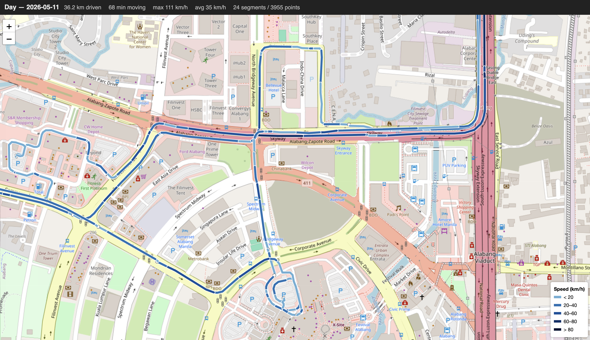

# dashcam-exporter (for DDPAI dashcams)

Turn the raw front + rear clips from a DDPAI dashcam SD card into one polished
MP4 per **trip** — with a moving GPS map widget, speed overlay, date/time
burn-in, automatic parking-skip, and per-trip HTML / GPX / Google Maps /
metadata sidecars.

A **trip** is the publishing unit: everything from leaving an anchor until the
car returns to it — or a long engine-off gap or the 04:00 day rollover ends it.
Short interior stops (fuel, lunch, a short hike) don't split a trip; they become
"Fast forwarding…" slides so the trip plays as one continuous video. See
[How trips are grouped](#how-trips-are-grouped) for the exact rules.

> **DDPAI only.** The card layout, GPS log format, and clip naming convention
> are specific to DDPAI cameras. Tested with **DDPAI Mola N3 Pro**. Should work
> with any DDPAI variant that uses the layout shown below.
>
> **Developed and tested on macOS.** It should work on Linux. **It has not
> been tested on Windows** — the basics (Python, ffmpeg, paths) are all
> cross-platform via `pathlib`, but font detection and default file paths are
> tuned for macOS. If you try it on Windows please open an issue.

Expected SD-card layout:

    /Volumes/NO NAME/DCIM/
        200video/front/   YYYYMMDDhhmmss_NNNN.mp4
        200video/rear/    YYYYMMDDhhmmss_NNNN_A.mp4
        203gps/           YYYYMMDDhhmmss_NNNN_D.gpx        # loose NMEA logs
        203gps/tar/       YYYYMMDDhhmmss_NNNN.git          # tarred NMEA logs


## Example output

Default layout — front camera, rear PiP bottom-centre, timestamp + speed +
watermark in corners, stats panel + map widget on the right:


Same composition with the rear PiP repositioned to the top-left corner
(`rear_pip_position = top-left` in config.txt):


The interactive HTML map sidecar (Leaflet + OSM tiles, route coloured by
speed, segment-break dots, opens in any browser):



The standard `.gpx` sidecar opened in [gpx.studio](https://gpx.studio) —
because the script emits one `<trkseg>` per contiguous-driving segment, each
engine-on leg of the trip shows up as its own colored polyline so you can see
the whole trip at a glance:


## What you get

For each trip the script produces a set of files whose names all lead with the
trip's **day label** (the 04:00-rollover date), so a publishing UI can glob a
whole day's trips by prefix:

| File | What it is |
|------|------------|
| `trip_YYYY-MM-DD_HH-MM_NN_h720.mp4` | Final video. Name is `trip_<day>_<start-time>_<global-index>_<size-tag>`, e.g. `trip_2026-05-11_12-11_08_h720.mp4`. Composed at 2402×1080 with map widget (or 1920×1080 without) and downscaled to the chosen height. The `_h720` tag reflects `output_height` (720 default; 540 for phone-sized, 0 for native 1080 → no tag). VT bitrate auto-scales to match, so smaller heights mean proportionally smaller files. Rendering at multiple heights produces side-by-side files instead of overwriting. |
| `trip_….html`                | Self-contained Leaflet/OSM interactive map. Un-tagged — one per trip regardless of video size. |
| `trip_….gpx`                 | Standards-compliant GPX. Opens in Google Earth, Strava, Maps.me, Komoot. |
| `trip_…_links.txt`           | Google Maps + Apple Maps URLs and trip stats. |
| `trip_…_meta.json`           | Machine-readable trip sidecar: `trip_index`, `day` (04:00 label), `start`, `end`, `duration_secs`, `n_clips`, `video`, `round_trip` (bool — `false` means a one-way relocation), `start_fix`, `end_fix`, `distance_km`. Un-tagged — one per trip. Meant for a publishing UI to group a day's trips and know each trip's shape without re-parsing GPS. |

The video frame layout (defaults):

```
+----------------------------------------+----------+
|                                        | Trip 8   |
|                                        | 2026-…   |
|              FRONT CAMERA              | Distance |
|                                        | Driven   |
|                                        | Max …    |
|                                        | Avg …    |
|                                        |          |
|         +------------------+           | +------+ |
|         |   REAR CAMERA    |           | | MAP  | |
|         +------------------+           | |      | |
|                                        | +------+ |
|                                        |          |
| 2026-05-11 18:07:52         19 km/h    |          |
|                      (c) Watermark …   |          |
+----------------------------------------+----------+
       1920 px main video                  480 px panel
                       2402 × 1080
```

Composed in this order:

1. **Front camera** — cropped (configurable bonnet trim) and scaled to 1920×1080.
2. **Rear PiP** — 662×372 with a thin white border. Position configurable
   (bottom-middle by default; or top-left / top-middle / top-right — the
   bottom-left/right corners are reserved for the timestamp and speed +
   watermark overlays). Auto-disabled if your dashcam has no rear camera.
3. **Timestamp** — `YYYY-MM-DD HH:MM:SS` burned into the bottom-left,
   advancing per frame from the clip's filename timestamp.
4. **Speed** — NN km/h (or NN mph) rendered as 1-second SRT subtitles in
   the bottom-right corner. Only when GPS data exists for the clip.
5. **Watermark** — small `©` line just below the speed (or any other corner
   via config; text is configurable).
6. **Stats panel** — Trip title (index + day label + start time), distance,
   moving time, max + avg speed, segments / GPS points, plus the route map with
   a moving marker. The full route is shown coloured by speed; the marker steps
   once per second. Stats text can be omitted while keeping the map.

When a trip has no GPS at all, the script falls back to plain 1920×1080
output (no map widget, no speed overlay) so per-trip output sizes stay
consistent within a run.


## Parking-skip

A trip can span several engine-on sessions, so it often contains long stretches
of "engine on, parked" footage at an interior stop.

**What you get.** By default those standstills are collapsed to a short beat as
you park, a `Fast forwarding… 46m 15s skipped` slide, and then a **clean cut to
the moment you drive away** — you never sit through parked footage, and you land
exactly when the car starts moving again.

**If you'd rather keep the parking movements** in the trip (backing out, jockeying
around a lot), don't skip at all: **`--no-skip-parking`**. Tune the trigger with
`parking_min_secs` / `parking_pad_secs` in `config.txt`.

That's the whole story for most people. The rest of this section is *how* the
clean cut is found, and is safe to skip.

<details>
<summary><b>For the nerds — how the drive-away is detected</b></summary>

The hard part is step "clean cut to the moment you drive away". The obvious
signal, GPS speed, is unreliable here: parking-mode clips are event snippets the
camera records whenever *something* moves nearby, so the footage is full of
passing people and cars while your car sits still, and the stale/jittery GPS
can't tell that apart from real driving. (This is what defeated an earlier
attempt.)

So when `numpy` + `opencv-python-headless` are installed, the exit anchor is
found by **video ego-motion** instead:

1. Sample the front clip at 4 fps, greyscale, downscaled.
2. Track ~300 features frame-to-frame (Lucas–Kanade optical flow).
3. Take the **median** flow magnitude. A passing car/person is a handful of
   outliers the median ignores; the car *actually* rolling sweeps the **whole**
   frame (features flow outward even driving straight; translate/rotate when
   maneuvering out of a spot), so the median jumps by ~two orders of magnitude.
4. Find the first sustained jump, walk back to where motion left the parked
   baseline = the drive-away second.

It reliably catches the car creeping out of a spot *below the GPS speed floor*,
and falls back to GPS (`find_drive_resume_second`), then a fixed skip, when the
libraries aren't installed or no clear signal is found. `--no-video-drive-detect`
(or `video_drive_detect = false` in `config.txt`) forces GPS-only. It's an
implementation detail — but one with a real-world effect, so the knob exists.

Debug tip: `--debug-cuts` produces a preview clip containing just the start /
pauses / stop of a trip (~20 s instead of the full render) so you can eyeball
exactly where the exit slice lands.

</details>


## Install (macOS)

The script needs **ffmpeg** with the `drawtext` (libfreetype) and `subtitles`
(libass) filters. The plain Homebrew `ffmpeg` doesn't include those — use
`ffmpeg-full`:

```sh
brew install ffmpeg-full
brew unlink ffmpeg 2>/dev/null
brew link --overwrite ffmpeg-full
```

Then the Python dependencies (only needed for the burn-in map widget):

```sh
python3 -m venv .venv
source .venv/bin/activate
pip install -r requirements.txt
```

The venv matters because Homebrew Python 3.12+ blocks system-wide `pip
install` per PEP 668. Re-activate the venv (`source .venv/bin/activate`) at
the start of every new terminal session.

Dependencies: `staticmap` (OSM tile background) and `Pillow` (marker
compositing). If you don't install them, the script still runs but skips the
burn-in map widget. Pass `--no-map-widget` to silence the warning.


## Install (Linux / WSL)

Same idea, different package manager:

```sh
sudo apt install ffmpeg                    # Debian/Ubuntu — usually includes drawtext + subtitles
python3 -m venv .venv && source .venv/bin/activate
pip install -r requirements.txt
```


## Install (Windows — untested)

Treat the steps below as best-effort guesses based on cross-platform
behaviour. **The script has not been tested on Windows.**

```powershell
# ffmpeg — pick one
winget install Gyan.FFmpeg          # or:  choco install ffmpeg-full
                                    # or:  scoop install ffmpeg

# Python deps
python -m venv .venv
.\.venv\Scripts\Activate.ps1
pip install -r requirements.txt
```

Things to watch out for:

- Default `root = /Volumes/NO NAME` will not exist — set `root = E:\` (or
  whatever drive letter your SD card mounts as) in `config.txt`.
- Default `out = ~/Desktop/Dashcam_Videos` works via `pathlib` (resolves to
  `C:\Users\<you>\Desktop\…`).
- VideoToolbox doesn't exist on Windows; encoding will fall back to
  software libx264 automatically (slower, but works).
- The script tries macOS fonts first then a few common Windows fonts
  (`courbd.ttf`, `cour.ttf`, `arial.ttf`). If none are found, pass
  `--no-timestamp` and `--no-watermark`-equivalent (`watermark_text =`).


## Quick start

```sh
source .venv/bin/activate           # macOS / Linux

# Dry-run to see what would be encoded (lists each trip with its index)
python3 make_dashcam_videos.py --dry-run

# Encode every trip on the card with full overlays
python3 make_dashcam_videos.py

# Only specific trips by index — see "Trips & indices" below
python3 make_dashcam_videos.py --drives 8       # --trips 8 is an alias

# List the trips found on the card without encoding anything
python3 make_dashcam_videos.py --dry-run

# Read from a local backup instead of the SD card, write somewhere specific
python3 make_dashcam_videos.py --root ~/dashcam_backup/2026-05-11 --out ~/Movies/Dashcam

# Just refresh the .html / .gpx / _links.txt / _meta.json sidecars without re-encoding video
python3 make_dashcam_videos.py --sidecars-only

# Smaller output file for web/mobile sharing
python3 make_dashcam_videos.py --output-height 540
```


## Helper shell scripts

For the common workflows there are two ready-to-run shell scripts in the
repo root. **Open them once and uncomment the `OPTS+=(…)` lines for any
settings you regularly want** that you DON'T already have in `config.txt`
(e.g. `--root /path/to/local/sd-card-copy`, `--out ~/Movies/Dashcam`,
`--output-height 720` for web-sized output). Anything you put in
`config.txt` is loaded automatically and doesn't need to go in the scripts.

| Script | What it does |
|--------|--------------|
| `./import-sd-card.sh [YYYY-MM-DD]`       | Copy the card's `DCIM` into a dated import folder, verify, then delete the card's files (keeping the folder tree). `--keep` copies without deleting; `--checksum` verifies byte-for-byte. |
| `./list-trips-data.sh`                  | Dry-run. Lists every trip with its 1-based index, 04:00-day label, start → end, clip count and duration. |
| `./make-trips-rendered.sh [N N …]`      | Encode. Pass the trip indices you want; with no args, encodes every trip. |

Typical end-to-end:

```sh
source .venv/bin/activate
./list-trips-data.sh             # see what's on the card
./make-trips-rendered.sh 8       # encode just trip 8
```

Each invocation of `make-trips-rendered.sh` tees stdout+stderr into
`./logs/trips-YYYYMMDD-HHMMSS.log` (full history kept). At the end of the
run, a copy of that log lands next to every `.mp4` the run produced — e.g.
`trip_2026-05-11_12-11_08_h720.log` alongside the matching `.mp4` in your
output folder, so the log lives with the data it describes. Override the log
location via the `LOG_DIR` environment variable.

The script also forwards arbitrary flags through to the Python:

```sh
./make-trips-rendered.sh 8 --force                       # overwrite existing
./make-trips-rendered.sh --sidecars-only                 # refresh sidecars only
./make-trips-rendered.sh 8 --output-height 720           # trip 8, 720p
```

Leading integers are treated as trip indices for `--drives`; the first
non-integer arg ends index parsing and everything from there onward is
passed straight to Python.


## Fragment / loop-recording handling

Dashcams loop-record onto the SD card — old footage gets overwritten when
the card fills up. The script will see those overwritten sessions as small
"fragments" (1–3 clips, a minute or two) at the head of the timeline. They
usually aren't useful as standalone videos.

By default the script **auto-skips trips smaller than `min_clips_per_group`
clips** (default 4). You'll see a one-line notice listing what got skipped:

```
Auto-skipping 7 fragment trip(s): #1 (1 clip), #2 (3 clips), #3 (1 clip), …
(force-encode by naming the index via --drives.)
```

To force-encode a fragment anyway, pass its 1-based index via `--drives`:

```
./make-trips-rendered.sh 1 2     # encode fragments 1 and 2 even though they're short
```

> The bundled example dataset is exactly this case: only trip 8
> (May 11, 104 clips, ~1h45m of driving) is a complete trip. The other 7
> are 1–3 clip fragments left from the loop overwriting earlier footage.
> With defaults you'll get just `trip_2026-05-11_12-11_08_h720.mp4`; the
> rest are noted and skipped.


## Trips & indices

The script groups all clips on the card into trips (see
[How trips are grouped](#how-trips-are-grouped)). Trips are numbered
1, 2, 3, … globally in the order they appear in `--dry-run`. The
`--drives N [N …]` flag (aliased `--trips`; the `--drives` name is historical)
selects specific trips by index. Examples:

```sh
# See the indices first
python3 make_dashcam_videos.py --dry-run
# →  Trip  1  day 2026-04-02  2026-04-02 12:30 -> 04-02 12:31     1 clips  ~1m
#    Trip  2  day 2026-04-11  2026-04-11 21:16 -> 04-11 21:24     3 clips  ~8m
#    …
#    Trip  8  day 2026-05-11  2026-05-11 12:11 -> 05-11 19:07   104 clips  ~1h45m

# Then encode only trip 8
python3 make_dashcam_videos.py --drives 8       # or: --trips 8
```

Indices are stable within a single run but **can shift if you change any of
the trip thresholds** (`--trip-return-m`, `--trip-leave-m`,
`--trip-day-rollover`), since the grouping changes. Always do `--dry-run`
first when in doubt.


## Output sizes

The pipeline composes every frame at the native **2402×1080** (1920 main
video + 2 px gutter + 480 panel) and downscales at the very end. The
default downscale is **720p**, a quality / size sweet spot. Override with
`--output-height` or `output_height` in `config.txt`.

The hardware (VideoToolbox) bitrate auto-scales by `(output_height/1080)²`
so a smaller frame produces a proportionally smaller file instead of being
over-encoded at 1080p-tier bitrate. Libx264 uses CRF and self-adjusts.

| Setting | Composite size | Typical file size, 1 h source | Best for |
|---------|----------------|--------------------------------|----------|
| `output_height = 0`           | 2402 × 1080 | ~3.5 – 4 GB | Archive, big-screen viewing |
| `output_height = 720` (default) | 1601 × 720 | ~1.5 – 2 GB | Detail-rich sharing — plates, signs |
| `output_height = 540`         | 1201 × 540  | ~400 – 500 MB | Phone-sized messaging / streaming |

These are end-pipeline scales — the encoder still composes on the native
2402×1080 frame so the overlays stay crisp, then scales the finished frame
down once. File sizes assume default `vt_bitrate = 8M` / `x264_crf = 23`
(VT bitrate auto-scaled per the formula above); tune those if you need
smaller still. 720 keeps plates and signs legible without ballooning files;
540 if you only ever watch on a phone; 0 is the right call for archiving.

The final filename bakes in the chosen height — e.g.
`trip_2026-05-11_15-30_13_h540.mp4`. `output_height = 0` produces the
un-tagged native-1080 name (`trip_2026-05-11_15-30_13.mp4`). Rendering the
same trip at multiple heights produces side-by-side files instead of
overwriting each other, and the format you have on disk is obvious from
the name.

Sidecars (`.html`, `.gpx`, `_links.txt`, `_meta.json`) stay un-tagged — they
only depend on the GPS track, not the video resolution, so one set covers
every rendered size.

When `map_widget = false` the panel is dropped and the composite is just
1920×1080 (or `output_height` × 16:9), shaving roughly 20 % off file size.


## config.txt — the main way to tweak things

Run once to dump a fully-commented template into the repo:

```sh
python3 make_dashcam_videos.py --write-config ./config.txt
```

Then uncomment whatever lines you want to change. Precedence is **CLI flag >
config.txt > built-in default**. Highlights:

- `root`, `out` — input / output paths
- `trip_return_m`, `trip_leave_m`, `trip_day_rollover`, `trip_min_m`
  — trip grouping (see [How trips are grouped](#how-trips-are-grouped))
- `audio = false` — strip audio entirely (passenger conversation privacy)
- `speed_unit = kmh | mph` — unit shown on overlay + stats + HTML + links.txt
  (GPX export is always m/s per the spec)
- `front_crop_top` / `front_crop_bottom` — tune for different bonnet shapes
- `rear_pip = true | false`, `rear_pip_position`, `rear_pip_w/h/margin`
- `map_widget`, `map_panel_w`, `map_panel_position = right | left`,
  `map_panel_gutter_px`, `panel_stats = true | false`
- `skip_parking`, `parking_min_secs`, `parking_pad_secs`
- `watermark_text`, `watermark_position`, `watermark_font_size`,
  `watermark_margin_h/v`
- `speed_font_size`, `speed_margin_v`, `speed_margin_r`
- `output_height` — 720 (default) for web sharing, 540 for phone, 0 for native 1080
- `vt_bitrate`, `vt_maxrate`, `x264_preset`, `x264_crf`


## CLI flags

| Flag | Effect |
|------|--------|
| `--config PATH`               | Use a config.txt at a non-default location. |
| `--write-config PATH`         | Dump the fully-commented config template and exit. Pass `.` to write `./config.txt`. |
| `--root PATH`                 | Dashcam SD-card / backup root (default: `/Volumes/NO NAME`). |
| `--out PATH`                  | Output folder (default: `~/Desktop/Dashcam_Videos`). |
| `--drives N [N …]` (alias `--trips`) | Only process specific trip numbers (1-based). Bypasses min-clips skip for those trips. |
| `--trip-return-m M`           | Back within M metres of the trip's anchor closes the trip (default 100). |
| `--trip-leave-m M`            | How far (m) the car must travel from the anchor before a return can close the trip (default 150). |
| `--trip-day-rollover H`       | Hour of day the trip/day label rolls over instead of midnight (default 4 = 04:00). |
| `--trip-min-m M`              | A group is only kept as a trip if its noise-pruned GPS track reaches at least M metres from the anchor; closer clusters (near-home puttering, parking-mode events, phantom fixes) are auto-skipped (default 500). |
| `--debug-cuts [SECS]`        | DEBUG PREVIEW (not a normal render): a short clip of **only** a trip's cut points — start, each parking/FF pause, stop — with the driving dropped. SECS = context kept around each event (not overall padding). ~20 s vs a full render, to check where cuts land. Writes a separate `*_debugcuts*.mp4`. Bare = 5 s. Default 0 (off). |
| `--min-clips-per-group N`     | Auto-skip trips smaller than N clips (default 4). Loop-recording fragments. |
| `--inter-clip-gap-secs N`     | Insert a "Fast forwarding…" slide whenever consecutive clips are >N s apart (default 60). |
| `--force`                     | Re-encode trips whose `.mp4` already exists (default: skipped). |
| `--sidecars-only`             | Only (re-)generate `.html` / `.gpx` / `_links.txt`; skip video encoding. |
| `--no-map-sidecars`           | Don't generate the sidecars either. |
| `--no-map-widget`             | Skip the burn-in side panel (output stays 1920×1080). |
| `--no-timestamp`              | Skip the date/time overlay. |
| `--no-speed`                  | Skip the GPS speed overlay even when GPX data exists. |
| `--no-audio`                  | Strip audio (passenger-conversation privacy). |
| `--no-skip-parking`           | Disable parking-skip altogether. |
| `--parking-min-secs N`        | Minimum parked-run length (s) before parking-skip fires (default 300). |
| `--parking-entry-pad N`       | Seconds of footage kept BEFORE the FF slide (default 5). |
| `--parking-exit-pad N`        | Seconds of footage kept AFTER the FF slide before drive-resume (default 10). |
| `--exit-skip-secs N`          | Seek N seconds into the exit clip when GPS-detected drive-resume isn't conclusive (default 45). |
| `--drive-resume-sustain-secs N` | Consecutive seconds of GPS motion required to count as "real drive" (default 30). |
| `--output-height N`           | Downscale final composite to this height. **Default 720** (quality / size sweet spot). 540 for phone-sized; 0 keeps native 1080. |
| `--software`                  | Force libx264 instead of macOS VideoToolbox. |
| `--keep-intermediates`        | Don't delete per-clip intermediates after concat. |
| `--dry-run`                   | List trips and exit without encoding. |


## How trips are grouped

Each front-clip filename is paired with its matching rear clip and the clips
are ordered by timestamp. Then they're segmented into **trips**. A trip is a
**park-to-park** unit anchored on where the car was last parked (carried
forward; a configured **home** is an extra always-valid park point):

> **DEPART** (drive away from the anchor) → **drive** → **ARRIVE + PARK** (return
> to the anchor/home and come to a stop).

The two boundaries — the pull-away and the pull-in — are found by **video
ego-motion**, not by a GPS radius. Departure = optical flow rising (the whole
frame starts to move); arrival = flow falling back to the parked baseline and
staying there. So a trip **includes the full pull-out and the full pull-in/park**
and lands on the real moments, instead of:

- ending ~10–15 s early because a GPS radius tripped while you were still
  rolling toward home at 27 km/h, or
- starting ~1 min late because near-home maneuvering re-crossed the radius and
  split the departure into a throwaway fragment.

Because only a **park at the anchor** closes a trip, an interior stop *elsewhere*
never does: drive **A → B, hang out any length of time, B → A** and that's **one
trip** with the stop at B cut out (B isn't the anchor). Between trips the car
sits parked at the anchor — those idle clips belong to no trip. A **ROLLOVER**
across `--trip-day-rollover`:00 (default **04:00, not midnight**) also
force-closes a trip, which bounds a one-way relocation (drive to a holiday base,
sleep, drive back days later = two trips).

Video ego-motion needs `numpy` + `opencv-python-headless` (see
[Parking-skip](#parking-skip)); without them, grouping falls back to the older
GPS-radius boundary (and is ~50× faster, handy for quick `--dry-run` iteration
via `--no-video-drive-detect`).

### Setting your home location

Home is **optional** but makes grouping far more robust. Because a home address
is personal, it is read from a **gitignored `.env`** file, never from the
committed `config.txt`. Copy the template and fill in your own coordinates:

```bash
cp .env.example .env
# then edit .env:
#   SET_HOME_LAT=<your latitude>
#   SET_HOME_LON=<your longitude>
#   SET_HOME_RADIUS_M=100      # metres counted as "at home"
```

Grab the coordinates from Google Maps — right-click your home and the first
menu line is `lat, lon`. A real environment variable of the same name overrides
the `.env` value. If no home is set, the anchor is just the carried park
location (still works; home mainly helps when the carried anchor is unreliable,
e.g. loop-recording ate the departure so a trip's footage starts already out on
the highway).

There is **deliberately no engine-off-duration rule** — a stop of any length
away from the anchor stays inside the trip as a "Fast forwarding…" slide, so a
trip can span multiple engine-on sessions and still play as one continuous
video. (A "trip" whose noise-pruned GPS never reaches `--trip-min-m` from the
anchor — near-home puttering, parking-mode motion clips, a lone phantom fix — is
auto-skipped as stationary.)

Every trip also carries a **day label** — the 04:00-rollover date — which
leads all its output filenames and lives in its `_meta.json`. The day is a
label, not a render mode: a publishing UI can glob `trip_2026-05-11_*` to lay
out that day's trips side by side.

**Tuning.** Adjust `--trip-return-m` / `--trip-leave-m` if returns close too
eagerly or not at all. Bump `SET_HOME_RADIUS_M` in `.env` if you park on the
street near home rather than in a fixed spot (100 m can be a touch tight).
Move `--trip-day-rollover` if your late-night driving lands on the wrong day.
Because changing any threshold re-segments everything, the trip indices can
shift — always `--dry-run` first after a change.


## How GPS speed is sourced

The dashcam writes GPS logs to `DCIM/203gps/` in NMEA format
(mislabeled with a `.gpx` extension). Older sessions are rolled up into
POSIX tar archives in `203gps/tar/` (mislabeled with a `.git` extension —
they are **not** Git data, just tar archives).

On startup the script:

1. Lists every loose `.gpx` in `203gps/`.
2. Extracts every `.gpx` member from every `.git` tar in `203gps/tar/` into
   `OUT_DIR/.gpx_cache/` (cached across runs).
3. For each clip, looks for a matching `.gpx` in either location.

The speed overlay is rendered per second from the `$GPRMC` speed-in-knots
field. For the demo card this expanded GPS coverage from **25 → 90 clips
(out of 117)**.

The GPS track is segmented before drawing so engine-off intervals don't get
bridged by phantom straight lines across town, and the polyline is coloured
by speed using a blue→navy palette that pops against OSM's yellow/orange
roads.


## Output layout

The exporter writes **one subfolder per extract day** (the 04:00-rollover day a
trip belongs to — which need not match the import folder's name, since one card
can span several days). Each day folder holds its trips plus an `info.txt`
naming the source import folder:

```
<--out>/                              # e.g. ~/rsc-data/Output_Dashcam/
├── 2026-05-11/
│   ├── info.txt                      # "source import folder: …/Import_Dashcam/2026-05-11"
│   ├── trip_2026-05-11_12-11_08_h720.mp4
│   ├── trip_2026-05-11_12-11_08.html
│   ├── trip_2026-05-11_12-11_08.gpx
│   ├── trip_2026-05-11_12-11_08_links.txt
│   ├── trip_2026-05-11_12-11_08_meta.json
│   └── trip_2026-05-11_19-40_09_…    # a second trip on the same day
├── 2026-07-15/
│   └── …                             # trips extracted from an import that spanned days
├── .gpx_cache/                       # harvested tar contents, reused across runs
└── .intermediates/                   # scratch — wiped at the start of every run
```


## Performance

Hardware-accelerated encoding via `h264_videotoolbox` on an Apple-silicon Mac
gets you roughly 5–10× realtime, so ~2 hours of source footage encodes in
15–25 minutes. On Linux/Windows you fall back to software libx264 — still
fine, just slower.

Caching policy:

- If a final `.mp4` already exists in `--out`, that trip is skipped.
  Re-render by deleting the .mp4 (or passing `--force`).
- Per-clip intermediates in `.intermediates/` are **scratch** — wiped at the
  start of every run and regenerated against the current config. This means
  any config tweak (head-trim pad, output_height, speed_unit, audio, …)
  always takes effect on the next render, no flag needed.
- Harvested GPX in `.gpx_cache/` IS cached across runs (expensive to redo
  and unaffected by encoding config). Old entries TTL out via
  `cache_max_age_days`.
- Sidecars are emitted unconditionally, even when the .mp4 already exists,
  so segmentation / palette / unit tweaks land via a quick `--sidecars-only`
  run.

To force a re-encode of one trip: delete its final `.mp4` (and the matching
intermediates if you want fresh per-clip work too).


## Troubleshooting

**`No such filter: 'drawtext'`** — ffmpeg without libfreetype. Install
`ffmpeg-full` (see Install), or run with `--no-timestamp`.

**`Unable to open … speed.srt` / `subtitles` errors** — ffmpeg without
libass. Install `ffmpeg-full`, or run with `--no-speed`.

**`no rear pair for YYYYMMDDhhmmss, skipping`** — A front clip exists with no
matching rear. The script drops it. To use a front-only setup set
`rear_pip = false` in `config.txt`.

**`map: (no GPS data for this trip)`** — Clip filenames in that trip don't
match any GPX (loose or tarred). Normal for trips without GPS lock.

**`Output looks squashed horizontally`** — Player isn't honouring SAR. The
video is yuv420p with square pixels; QuickTime / VLC / IINA all handle it.

**`OSM tile fetch failed (…)`** — Network problem during burn-in widget
render. The HTML map (Leaflet) still works fine since OSM tiles load in your
browser at view time.

**`error: externally-managed-environment`** — Homebrew Python blocks
system-wide `pip install` (PEP 668). Use the venv recipe in Install.

**`! map widget skipped: PIL/Pillow not installed`** — venv not activated,
or `pip install -r requirements.txt` was never run. Video still encodes at
1920×1080 with all other overlays.


## Architecture

Pipeline per clip:

```
front.mp4 ─┐
           ├─► ffmpeg filter_complex:
rear.mp4  ─┤    crop + scale front  →  [front]
           │    scale + border rear  →  [rear]
           │    overlay [rear] on [front] at chosen position
           │    drawtext timestamp (bottom-left)
           │    subtitles speed.srt (bottom-right)
           │    drawtext watermark (chosen corner)        → [video_part]
map.mp4   ─┤    [2:v] scale to 480×1080 + 2-px gutter pad → [map_part]
           │    hstack [video_part][map_part]              → [out]
           ▼
       clip_NN.mp4  (intermediate, 2402×1080)
           ▼
       concat-demuxer  (stream-copy, no re-encode)
           ▼
       final trip_….mp4
```

The map.mp4 is produced by PIL/staticmap:

```
all GPX points for the trip   →  base panel PNG (stats + route + start/end markers)
                                 +
each second of clip            →  marker dot composited on base PNG
                                 ↓
                             PNG sequence
                                 ↓
                         ffmpeg 1-fps mp4  →  map.mp4
```

The 1-fps map gets upsampled to 30 fps by the main filter chain, so the
marker visibly steps once per second.


## Repo layout

```
dashcam-exporter/
├── make_dashcam_videos.py        # the single-file script (entry point)
├── config.txt                    # generated by --write-config; edit to taste
├── requirements.txt              # Pillow + staticmap
├── list-trips-data.sh            # dry-run: list every trip with its index
├── make-trips-rendered.sh        # encode a chosen trip (or all)
├── examples/                     # screenshots used in this README
├── .gitignore
├── LICENSE
└── README.md                     # this file
```


## Funding

- 🏅 https://github.com/sponsors/raoulsson
- 🪙 https://www.buymeacoffee.com/raoulsson


## License

MIT — see [LICENSE](LICENSE).

Copyright © 2026 Raoul Marc Schmidiger ([hello@raoulsson.com](mailto:hello@raoulsson.com)).

---

**Happy Driving! 🎉**
